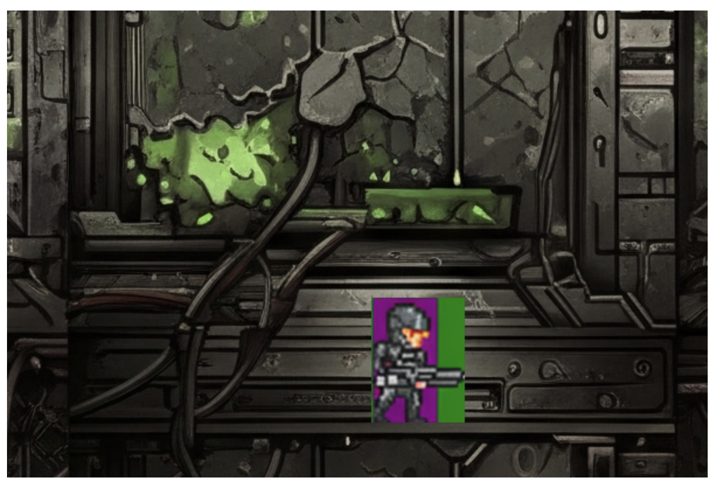

# Generating a video game

This repo contains some sample prompts and assets to help with generating an arcade style video game using github copilot in vscode.

- Checkout [Prompts](prompts) folder for prompt examples
- Checkout [Resources](Resources.md) for links
